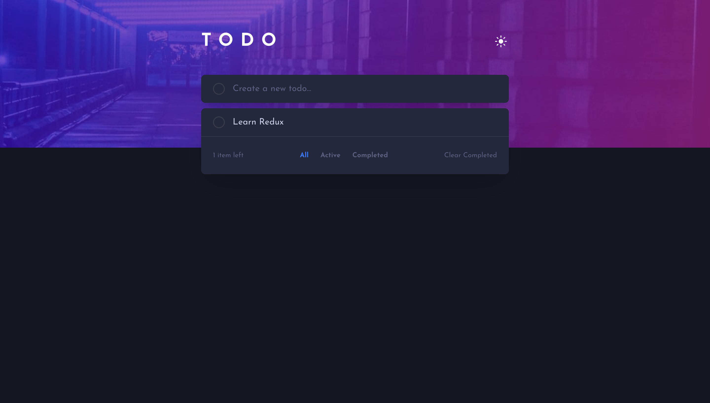

# Frontend Mentor - Todo app solution

This is a classic todo app that allows you to add, complete, and delete tasks. It also includes features like filtering tasks by status (all, active, completed), clearing completed tasks, and toggling between light and dark themes. This project was built as a solution to the [Todo app challenge on Frontend Mentor](https://www.frontendmentor.io/challenges/todo-app-Su1_KokOW).

## Table of contents

- [Overview](#overview)
  - [The challenge](#the-challenge)
  - [Screenshot](#screenshot)
  - [Links](#links)
- [My process](#my-process)
  - [Built with](#built-with)
  - [Getting Started](#getting-started)
  - [What I learned](#what-i-learned)
  - [Continued development](#continued-development)
  - [Useful resources](#useful-resources)
- [Author](#author)
- [License](#license)

## Overview

### The challenge

Users should be able to:

- View the optimal layout for the app depending on their device's screen size
- See hover states for all interactive elements on the page
- Add new todos to the list
- Mark todos as complete
- Delete todos from the list
- Filter by all/active/complete todos
- Clear all completed todos
- Toggle light and dark mode

### Screenshot



### Links

- Live Site URL: [Demo Link](https://todo-app-taophyc.vercel.app)

## My process

### Built with 

- [React](https://reactjs.org/) - JS library
- [Redux](https://redux.js.org/) - State management
- [TypeScript](https://www.typescriptlang.org/) - Typed JavaScript
- [Vite](https://vitejs.dev/) - Build tool
- [Tailwind CSS](https://tailwindcss.com/) - For styles

### Getting Started

To get a local copy up and running follow these simple example steps.

**Prerequisites**
* npm
  ```sh
  npm install npm@latest -g
  ```

**Installation**
1. Clone the repo
   ```sh
   git clone https://github.com/taophycc/Todo-app.git
   ```
2. Install NPM packages
   ```sh
   npm install
   ```
3. Run the app
   ```sh
   npm run dev
   ```

### What I learned

This project was a great opportunity to practice my front-end skills. I particularly enjoyed:
- Building a responsive layout with Tailwind CSS and its mobile-first approach.
- Managing application state with Redux Toolkit, which helped me keep the code organized and scalable.
- Using TypeScript to write more robust and maintainable code.
- Creating reusable React components for different parts of the UI.

### Continued development

In the future, I would like to expand this project by:
- Implementing the drag-and-drop feature to reorder the list.

### Useful resources

- [React Documentation](https://reactjs.org/docs/getting-started.html) - The official React documentation is always a great place to start.
- [Redux Toolkit Documentation](https://redux-toolkit.js.org/introduction/getting-started) - The official Redux Toolkit documentation was very helpful for state management.
- [Tailwind CSS Documentation](https://tailwindcss.com/docs) - The Tailwind CSS documentation is excellent and has everything you need to get started.
- [TypeScript Documentation](https://www.typescriptlang.org/docs/) - The official TypeScript documentation is a great resource for learning the language.

## Author

- Website - [Taofeek Kassim](https://github.com/taophycc)
- Frontend Mentor - [@taophycc](https://www.frontendmentor.io/profile/taophycc)
- Twitter - [@taophyc_](https://www.x.com/taophyc_)

## License

Distributed under the MIT License. See `LICENSE` for more information.
